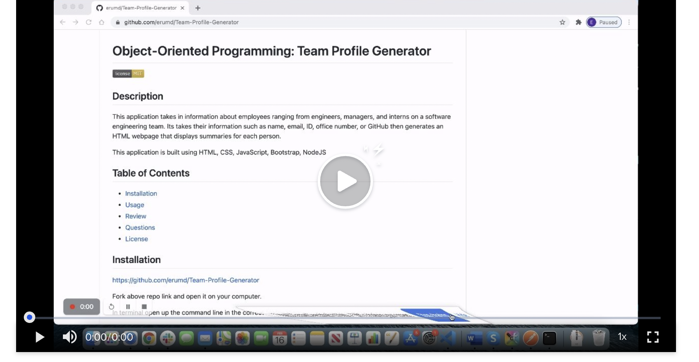

# Object-Oriented Programming: Team Profile Generator

## Description

This application takes in information about employees ranging from engineers, managers, and interns on a software engineering team. Its takes their information such as name, email, ID, office number, or GitHub then generates an HTML webpage that displays summaries for each person.

This application is built using HTML, CSS, JavaScript, Bootstrap, NodeJS

## Table of Contents

- [Installation](#installation)
- [Review](#review)
- [Questions](#questions)
- [Contribution](#contribution)
- [License](#license)

## Installation

https://github.com/erumd/Team-Profile-Generator

Fork above repo link and open it on your computer.

In terminal open up the command line in the correct file location.

This application will be invoked by using the following command:bash & node index.js

When prompted, choose from employee role to add, and enter your response.

Open generateIndex.html file to view your input .

## Video Walk through

Use this link to watch a video on how to use this app to automatically generate a Team Profile webpage. [https://video.drift.com/v/ab5EWxvEzAl/].

## Questions

For questions checkout my GitHub account (https://github.com/erumd) or email me at erumdhukka531@gmail.com

https://erumd.github.io/Team-Profile-Generator/

https://github.com/erumd/Team-Profile-Generator

## Contribution

I would like to thank my classmates and tutor for helping me create this application. Without their help this would not have been possible. There many ways to write the code for this application and they helped me understand and pick the code I was most comfortable and confident writing.

## License

MIT License

    Copyright (C), 2021, Erum Dhukka
    Permission is hereby granted, free of charge, to any person obtaining a copy
    of this software and associated documentation files (the "Software"), to deal
    in the Software without restriction, including without limitation the rights
    to use, copy, modify, merge, publish, distribute, sublicense, and/or sell
    copies of the Software, and to permit persons to whom the Software is
    furnished to do so, subject to the following conditions:
    The above copyright notice and this permission notice shall be included in all
    copies or substantial portions of the Software.
    THE SOFTWARE IS PROVIDED "AS IS", WITHOUT WARRANTY OF ANY KIND, EXPRESS OR
    IMPLIED, INCLUDING BUT NOT LIMITED TO THE WARRANTIES OF MERCHANTABILITY,
    FITNESS FOR A PARTICULAR PURPOSE AND NONINFRINGEMENT. IN NO EVENT SHALL THE
    AUTHORS OR COPYRIGHT HOLDERS BE LIABLE FOR ANY CLAIM, DAMAGES OR OTHER
    LIABILITY, WHETHER IN AN ACTION OF CONTRACT, TORT OR OTHERWISE, ARISING FROM,
    OUT OF OR IN CONNECTION WITH THE SOFTWARE OR THE USE OR OTHER DEALINGS IN THE
    SOFTWARE.
